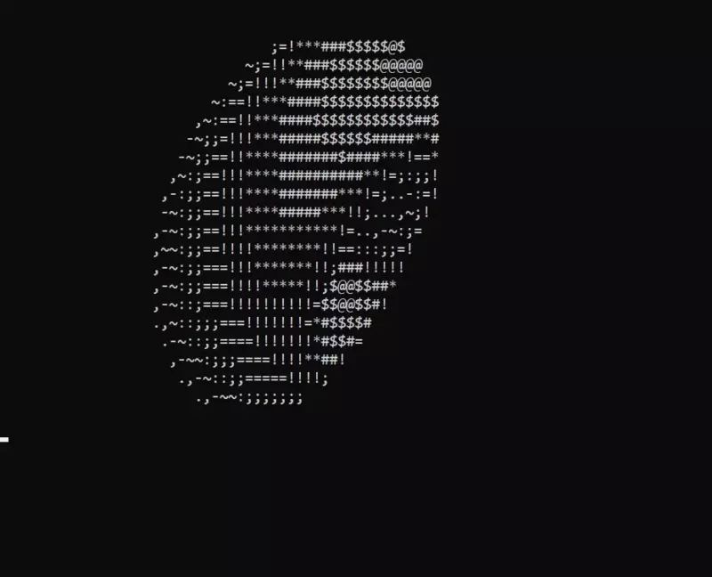

# ASCII-Spinning-Donut

A simple ASCII spinning donut in C.

The actual logic behind of it can be found [here](https://www.a1k0n.net/2011/07/20/donut-math.html).

## Demo



## Usage

```bash
$ make donut
$ ./donut
```

## Why?

I was bored and wanted to learn C.

## License

[MIT](LICENSE)
